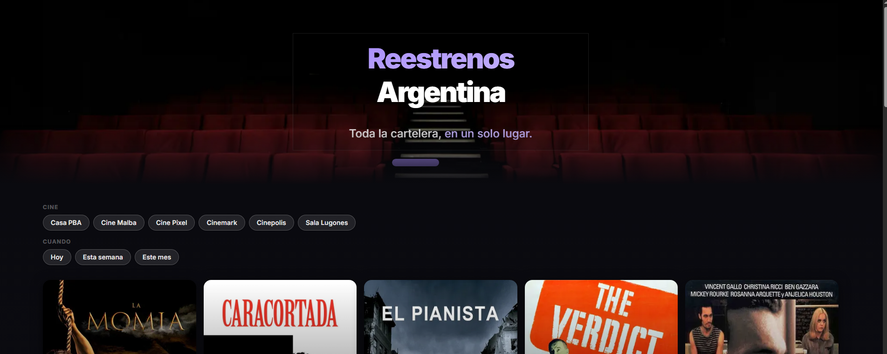

# ReestrenosArg
### https://reestrenosarg.vercel.app/

### Agregador de reestrenos de películas en cines de Argentina, tanto comerciales como independientes. 

## Stack
- Database: PostgreSQL + Prisma 
- Backend: Typescript + Express + Node.js 
- Frontend: React + Next.js
- Web Scrapping: Playwright

## Key Features:
- Lógica de web scrapping encapsulada en una clase, la cual permite agregar cines facilmente, solo teniendo que definir los selectores + algún comportamiento especial(como cerrar un popup).
- Integración con la API de TMDB para obtener imagenes, descripciones, géneros entre otros datos.
- Algoritmo que permite diferencia películas con el mismo nombre, comparando fecha de estreno y popularidad.
- UI optimizada para dispositivos móviles y de escritorio con tecnologías actuales.
 
## Cines Soportados:
- Malba
- Sala Lugones
- Cinemark
- Cinépolis
- Pixel
- Casa PBA
